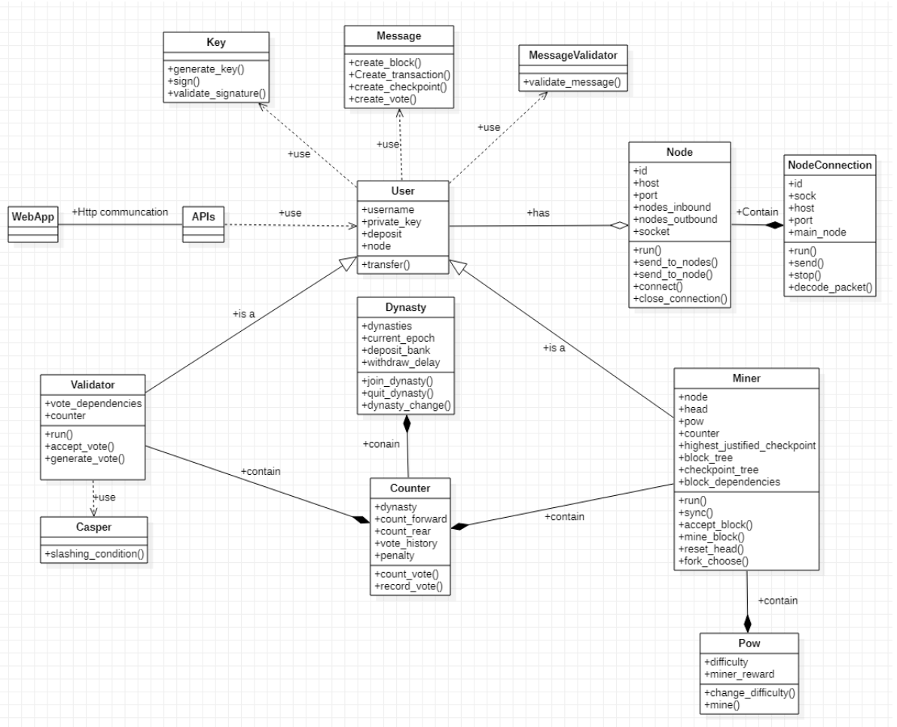
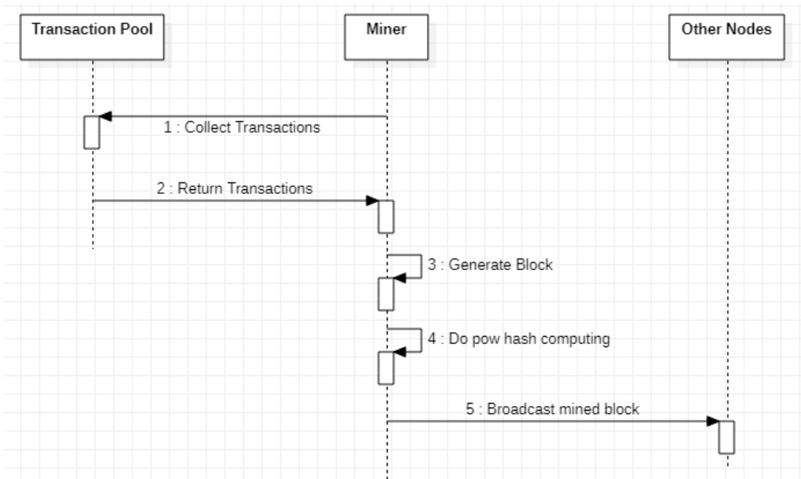
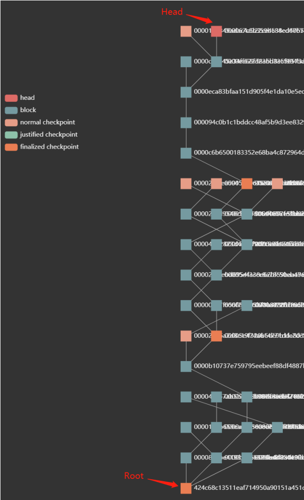

# Casper in Blockchain

## Abstract 

We  want  to  introduce  consensus  algorithm  to  a  public  blockchain  application.  The tolerance  of  fail-stop  failures  and  byzantine  failures  and  the  scalability  of  nodes  in network  are  mainly  required.  In  this  report,  we  demonstrate  why  Casper  meet requirements more than other algorithm and the process of applying Casper into our application. 

**Key words:** consensus algorithm, Casper, PoW, PoS, Raft, PBFT, blockchain 

## 1. Introduction 

With the continuous development of technology, a new type of electronic cash system is proposed, which  realizes  direct  transactions  between  the  payer  and  the  receiver  through  peer-to-peer technology. This system eliminates third-party financial institutions in the middle of the transaction. The currency traded in this system is called Bitcoin and an emerging technical term arises from it which is the blockchain. Blockchain is used to implement the underlying technology of Bitcoin. A block is a storage unit to record information. The link between blocks is realized through a hash algorithm, and each block stores the hash value of previous block. With the increase of transaction information, new blocks are continuously generated and linked with previous blocks. Then a chain of blocks is formed that is blockchain(Nakamoto,2008). 

Coulouris, Dollimore, & Kindberg(2005) claim that consensus is a kind of agreement problem, which refers to the processes of reaching agreement on a certain value after one or more processes propose how much the value should be. 

What is more important is that consensus mechanism is the core feature of distributed ledger based on blockchain. Its algorithm can ensure the consistency of the block information of each chain. It can also improve the difficulty of malicious tampering and the security of the system(Ahmad, Saad, Kim, Nyang, & Mohaisen, 2021). 

At present, block technology has applications in many fields, such as digital currency (Bitcoin), Ethereum, etc. 

There are three types of blockchains which are public block chains, federated block chains and private block chains(Andreev, Andreeva, Krotov, & Krotova, 2018). What we want to study is the public block chains, and explore the relevant consensus algorithms which are Raft, PBFT(Practical Byzantine-Fault-Tolerant), PoW(proof of work), PoS(proof of stake) and Casper. 

There are four major parts in our paper. Firstly, we will understand each consensus algorithm through reading the relevant paper. Then a detailed comparative analysis of each algorithm is conducted. Next, we will focus on the details of Casper algorithm, such as the implementation details  of  the  Casper  algorithm  and  a  demonstration  of  liveness  and  safety. And  a  detailed description based on the realization of Casper algorithm is made. Finally, we will summarize the paper and put forward a prospect for the future. 

## 2. Related Work 

In this part, we will show the referenced literature and our overall research process. 

In the consensus mechanism, there are two types of failures that need to be considered: Fail-stop failures and Byzantine failures. 

By reading the paper "In Search of an Understandable Consensus Algorithm" published in 2014 by Diego Ongaro and John Ousterhout of Stanford University, we can find that the raft algorithm is proposed in the paper and the algorithm solves the above-mentioned Fail-stop failures to a certain extent. The paper is mainly based on the Multi-Paxos algorithm to re-simplify the design and implementation, which improves the engineering practice. The Raft algorithm simplifies the process and improves efficiency by first selecting the leader node (Ongaro, & Ousterhout, 2014). 

By referring to the paper "Practical Byzantine Fault Tolerance" published by Liskov in 1999, we found that the paper proposed the PBFT algorithm, and the algorithm solved the above-mentioned Fail-stop failures and Byzantine failures to a certain extent. This paper proposes and describes in detail the principle and implementation process of the PBFT algorithm. PBFT provides (N-1)/3 fault tolerance on the premise of ensuring availability and safety , where N is the total number of nodes in the cluster. At the same time, the PBFT reduces the operating complexity of the Byzantine protocol, from exponential level to polynomial level (Polynomial), making the application of Byzantine protocol in distributed systems possible (Castro,& Liskov, 1999). 

In addition, we also studied other consensus algorithms which are PoW and PoS because we want to implement distributed ledger applications based on the public chain. 

By reading the paper "Bitcoin: A Peer-to-Peer Electronic Cash System" published by Satoshi Nakamoto in 2008, it can be found that the author mainly proposed an electronic payment system that does not require a credit intermediary in the paper. And the author also described in detail all the rules and incentive measures required by the system. The system uses digital signatures, hashing and timestamps to prevent double-spending problems, and uses the PoW mechanism to make the system reliable and safe. What is more, the paper described the PoW mechanism in detail. By introducing a random number nonce, the random hash value of the block contains a specified number of zeros (Nakamoto,2008). 

By reading Lepore et al.'s 2020 paper on 'A Survey on Blockchain Consensus with a Performance Comparison of PoW, PoS and Pure PoS', it is found that the paper mainly describes the PoW and PoS mechanism and proposes two new mechanisms Pure PoW and pure PoS. The authors also compare  the  performance  of  the  four  algorithms.  By  reading  the  specific  details  of  the  PoS mechanism, we have a deeper understanding of the relationship between PoW and PoS.(Lepore et al., 2020). 

When Ethereum went from version 1.0 to version 2.0, its consensus protocol also transitioned from 

PoW to PoS. At the same time, the Casper algorithm was used to ensure the liveness and safety of the blockchain. 

By studying the paper "Casper the Friendly Finality Gadget" published by Buterin & Griffith in 2017, it can be found that the Casper algorithm proposed in the paper combines PoS and Byzantine fault-tolerant algorithms, and it is a finality system that can overlay the PoW blockchain. The article mainly explains the characteristics of the Casper algorithm, such as accountability and dynamic validators(Buterin, & Griffith, 2017).  

## 3. Comparative analysis 

Our project is trying to construct a public blockchain, which means that everyone has read or write access on the blockchain. We compared several most common protocols that are used to achieve consensus in blockchain.  

Raft was proposed by Ongaro and Ousterhout in 2014. It operates by electing a leader within the group. The leader is responsible for accepting requests and managing the replicate log to other servers. (Fu et al., 2021). The raft protocol is easy to understand and implement. It is also very efficient. According to Ongaro and Ousterhout (2014) research, Raft only uses the minimum number of messages, which is a single round-trip from leader to half the group, when a leader wants to replicate new log entries. And various optimizations can be applied into the raft protocol to improve its performance. However, the main limitation of raft is it cannot solve the Byzantine problem which reduces the applicability of real life. On the contrary, PBFT can tolerate Byzantine faults. And PBFT can achieve consensus without performing complex mathematical calculations, but the major drawback for PBFT is the exponentially increasing messages when extra nodes are added into the network. In the research from Azbeg et al (2021), the PBFT model only functions effectively when there are a small number of nodes in the distributed network. Since one entity controls many identities in PBFT, PBFT is also susceptible to Sybil attacks. Attackers could out- vote other good nodes when attackers create enough fake identities. Therefore, PBFT is more suitable for private and consortium blockchain.  

Since our project is trying to construct a public blockchain, which means the raft and PBFT are not the best choice for our project. Compared with private or consortium blockchain, anyone has read or write access on the public blockchain. The most famous and well-known consensus protocol for public blockchain is PoW. It is the first consensus algorithm used by Blockchain and Ethereum. According to the research, the main idea of PoW is that miners must solve a complex crypto-graphical problem with their computing power. The node that first solves the puzzle can be permitted to create a block. The mining process is extremely computation-intensive and requires significant power consumption. A malicious attacker can overthrow one block in a chain. Moreover, if attackers’ fraction of the computational power is 50% or more then the blockchain network will be undermined, which is also well-known as 51% attack. (Zhang & Lee, 2020).  

The PoS (Prood of Stake) protocol was proposed as an alternative to PoW protocol. Unlike PoW, PoS determine which node should be the one to create a new block based on its coin stake, which could reduce the cost of massive energy consumption. The concept is that the more coins the staker has, and there will be a bigger chance this staker will add a new block to the blockchain. And there are other mechanisms to taking into consideration. After the staker is selected and other nodes on the network verified this block. The staker gets back its stake along with the reward and has to reset its coin-age to 0 so that its priority will not preserve in the next selection round. If the block is not successfully verified by other nodes, the staker will be marked as ‘bad’ and lose all stake.  

Compared with PoW, PoS can reduce the massive energy consumption and find a better mechanism to handle the 51% attack. According to Zhang and Lee's (2020) study, PoS is also probabilistic-finality protocols same as PoW. If attackers want to displace a valid chain with its private chain, they need to accumulate more than half of the coins or computational powers on the network. With a PoS protocol, the attackers have to obtain 51% of the cryptocurrency to carry out a 51% attack. a miner holding 51% of the shares would have no incentive to attack a network of which they hold a majority share. Because the value of its share will drop if the value of the cryptocurrency drops. They would be more likely to maintain a secure network to maintain the value of their share.  

Since PBFT is only suitable for a network with a small number of nodes, the scalability of PBFT may not be ideal. Even though PoS and PoW got better scalability compared with PBFT. But the TPS, transaction throughput per second, is relatively low. TPS represents the number of transactions executed in one second. Zhang and Lee (2020) stated that the TPS of Bitcoin with PoW is only 3-7. Ethereum can handle roughly double that amount. Those amount of TPS limits the application prospect of PoW in payment of real life. There are some technical that can help improve PoS scalability. Poon and Dryja (2016) study found that Bitcoin enhances its scalability by adopting the lighting network to provide the off-chain payment. In Poon and Buterin's (2017) study, the sharding technology and Plasma were proposed by Ethereum, which work as a way to scale out the blockchain. But still, those technologies are not scalable enough for higher volume workloads. 

And Ethereum is moving to PoS from PoW. Buterin et al (2020) stated that Ethereum proposed a hybrid PoW/ PoS model —Casper FFG. In Casper, there will be a PoS finality system that overlays on an existing PoW blockchain. Casper also implement slashing conditions to identify malicious nodes and punish them. As Ethereum and Ogino(2021) stated that, Casper is more decentralized compared with single PoW protocol and it also permits secure sharding, which allows creating multiple blocks at the same time to increase the transaction throughput. Compared with PoS, Casper got better mechanism to identify malicious nodes and punish mechanism. 

Therefore, we decided to implement this relatively new algorithm — Casper to learn more about PoW mining process and the PoS validation mechanism. 

## 4. Casper Discussion and implementation 
### 4-1. Overview and purpose of Casper 

Casper algorithm is a hybrid PoW/PoS algorithm, which is mainly used in Ethereum. In Casper, the PoW algorithm is used in the system to propose a block. However, due to the network delay and the existence of malicious nodes, there may be multiple child blocks for a parent block in the process of proposing a new block. Therefore, the PoS algorithm in Casper is used to maintain an additional layer of finality checkpoint tree from the blockchain, where the finality checkpoint in the tree is a linear unique structure.  

Casper algorithm, like other consensus algorithms, aims to justify and finalize blocks so that all users maintain the same unique main chain. Here, especially for the finalized blocks, the transactions involved will not be reversed. 

### 4-2. Details of Casper algorithm 
#### 4-2-1. Block tree and Checkpoint tree 

In Casper, the proposal mechanism is similar to the PoW algorithm, and this mechanism will propose blocks and generate the underlying block tree. Meantime, Casper will propose and maintain an additional side tree, which is a checkpoint tree upon the existing block tree. The essence of the checkpoint here is still a block in the underlying block tree. As shown in Figure 1, the root in the block tree is called genesis block, and it is also used in the checkpoint tree to expand as root. For the checkpoint tree, the epoch is set to *k* which means that every block whose height *h* is a multiple of *k* will be proposed as a checkpoint. The hash of checkpoint is the original hash of related block and the height of checkpoint is set as *h/k*. As in Figure 1, the value of *k* is 3 and the red blocks are checkpoints. The formation and maintenance of the checkpoint tree mean that Casper not only maintains the block tree but also maintains a subtree of checkpoints. 

*Figure 1 - The checkpoint tree discovered from block tree* 

#### 4-2-2. Validators and Votes 

Any user can be a validator by depositing a minimal number of coins and acquire the right to vote. After finalizing a checkpoint, the validator can get a certain reward. Similarly, in the case of violating any rule, the validator will be punished as a malicious node and lose deposit. These mechanisms restrict the behavior of validators and increase the cost of malicious activities to ensure all validators more inclined to finalize checkpoints. Due to the existence of deposit, the security of PoS depends on the size of the deposit of each validator. Therefore, in this project, 2/3 of the total deposit will be used as the voting standard. 

For each validator, it can put forward a vote message and broadcast it to other validators. Here, only checkpoints can be involved in vote message. The vote message of validator *v* is normally written as *(s, t, h(s), h(t))*, and the information contained is shown in Table 1.  

*Table 1 - The vote message* 

It requires checkpoint *s* is the ancestor of checkpoint *t* in the checkpoint tree, and the validator *v* of this vote is in the related dynasty which will introduce in section 4.2.5. If either requirement is not satisfied, then the vote will be considered as an invalid vote. Some key terms are also involved here: 

- Supermajority Link *a -> b*: *a* and *b* both are checkpoints. When there are at least 2/3 validators’ deposit have voted that the *a* as the source and *b* as the target, then *a - > b* will be a supermajority link. Here, the height of *b* is greater than that of *a*. As shown in Figure 2, the red lines are two different supermajority links. 

*Figure 2 - The supermajority link in the checkpoint tree(all nodes is checkpoints)* 

- Justified checkpoint: The checkpoint *b* is justified if the *b* is genesis block or there is a supermajority link *a - > b* and checkpoint *a* is justified. For instance, In Figure 2, the root checkpoint is justified, and it has *root->a*, so checkpoint *a* is justified. And similarly, checkpoint *b* is justified. 
- Finalized checkpoint: Checkpoint *a* is finalized, If the *a* is genesis block or if there is a supermajority link *a - > b*, checkpoint *a* is justified and has the direct Child *b*. Here checkpoint *b* is the direct child of *a*, which means *H (a) + 1 = H (b)*. For instance, In Figure 2 the root is finalized and the checkpoint *a* cannot be finalized because checkpoint *b* is not a direct child of *a*. 
#### 4-2-3. Slashing condition 

To ensure the security of the validator voting, two rules are set here to ensure that any validator cannot violate. As a single validator, it cannot publish two distinct votes *(s1, t1, h(s1), h(t1))* and *(s2, t2, h(s2), h(t2))* make any of the following two rules exist: 

**Rule 1:**  *h(t1)  =  h(t2)*,  two  different  votes  form  a  validator  have  the  same  height  of  target checkpoint 

**Rule 2:**  *h(s1) < h(s2) < h(t2) < h(t1)*, the source and target of a vote cannot be in the range of any other vote. 

In the network of the validator, any validator that violates any of the above rules will be detected by other validators, and the evidence of violation will be included in the blockchain as a transaction. At this time, the malicious validator will be penalized, and all of its deposits will be taken away, while the validator that detects the violation and submits evidence will get a certain amount of reward. This feature makes Casper avoid 51% attack in the PoW algorithm. 

#### 4-2-4. Fork choice rule

The fork choice rule specifies the default behavior of each validator, that is all validators will follow the fork with the greatest height justified checkpoint. The justified checkpoint will mark the main fork so that all validators will continue to propose new blocks at the main chain with the greatest height justified checkpoint instead of building on the longest chain. It can be avoided an additional penalty for the validator in the wrong chain fork. 

#### 4-2-5. Dynamic Validators

In Casper, validators play an important role in deciding which checkpoint will be labelled as justified and finalized by voting. And the set of validators who can do vote for a checkpoint is defined as the dynasty of this checkpoint. Each dynasty is labelled with epoch, and the epoch of dynasty is defined as the number of finalized checkpoints before the related checkpoint. The dynasty is changing as the linear increasement of epoch. Validators can join or quit by changing the members of dynasty in later epoch. 

### 4-3. Liveness and Accountable safety 

**Liveness:**  Liveness for the Casper algorithm is to ensure that all the finalized chain has the child to extensions. This is because the fork choice rule guarantees that all validators will be extended on the main fork where the great height justified checkpoint is located, so that this fork has the last finalized checkpoint.** 

**Accounting safety:**   Accounting safety enables Casper algorithm to detect no more than 1 / 3 malicious nodes. It is guaranteed by slashing condition, so If these malicious nodes violate rules, it will be detected and punished. 

### 4-4. Implementation 
#### 4-4-1. GitHub

The latest code and handbook can be accessed and viewed at below:  [https://github.com/EMOSAMA/casper-blockchain ](https://github.com/EMOSAMA/casper-blockchain)

#### 4-4-2. Implementation Method 

The programming language which was used in this project is Python, the Flask development framework was used to build APIs. And a python script is used to generate HTML page which can collect data from APIs and do visualization.  

#### 4-4-3. Development Model and Progress 

We adopt Agile development model into our project. We have divided our implementation process into four stages:  

1. Building a distributed ledger application of blockchain which based on the proposal mechanism, PoW consensus algorithm. 
1. Introducing Casper which based on default validators dynasty into the above application. 
1. Developing dynamic dynasty function to allow new validator to join and old validator quit. 
1. Implement web page which can help visualize our application. 

Regard each stage mentioned above as a sprint, and each sprint last 5 days. The burndown charts which can show our working progress of each sprint are shown in Figure 3: 

*Figure 3 – Burndown Chart* 

#### 4-4-4. Implementation Details

*Figure 4 – Class Diagram* All discussion below is based on the Class Diagram in Figure 4. 

##### 4-4-4-1. Characters

There are three main characters in our application, user, miner, and validator. Both miner and validator are the subclass of user. Both miner and validator contain a counter which can count the received vote and record vote history of each voter. But only validator in dynasty can do vote. 

**User:**  Each user has a unique username which is public key, and a private key which is used to do signature. All the functions related to key are provided in file Key.py. And the MessageValidator is used by user to validate the signature on received message. User can transfer coins to others by submit transaction. The sequence chart in Figure 5 can show the process.  

*Figure 5 – Transaction Sequence Chart* 

**Miner:**  Miners can package selected transactions into block and computing block hash under the PoW algorithm. The PoW algorithm is defined in file Pow.py, the difficulty attribute inside it can decide difficulty of the algorithm. Since the block hash has been computed, miner can proposal this block to other nodes. After the block is validated and status as finality, a reward will be acquired by related miner. The reward transaction is packaged into the proposal block when the miner generate the block. The sequence chart of mining block is shown in Figure 6.  

*Figure 6 – Mine Block Sequence Chart* 

**Validator:**  Validator can accept and record blocks and generate checkpoint when the height of block reaches the checkpoint epoch time. When a checkpoint be created, validator will proposal a supermajority link by generating a vote. Each validator can only produce a vote at each epoch. The target in the vote should be the newest generated checkpoint and the source in the vote should be the current highest justified checkpoint. After generating the vote, validator will broadcast the vote to other nodes. Since a validate receive a vote, the vote will be counted in a counter which is provided by file Counter.py and the slashing conditions and voter’s identification will also be validated . If a supermajority link reach 2/3 votes, the source checkpoint and target checkpoint will be evaluated. The voting process is shown in the Figure 7. 

*Figure 7 – Vote Supermajority Link Sequence Chart* 

##### 4-4-4-2. Networks 

The network in our application is a full connected network. Each User will hold a Node which contains  socket.  Each  Node  keeps  multiple  connection  channels,  each  connection  channel  is connected to another Node. If there are 5 Nodes, each Node will keep 4 connection channels. The connection channels are defined in file NodeConnection.py. 

##### 4-4-4-3. Dynasty 

The Dynasty defined the validator set which contain validators who can do vote. A list keeps here which contain all the dynasties. Each dynasty contains three sub list, the first list is the Newer list, the second list is the Member list, and the third list is the retired list. If a validator asks to join at dynasty N, it will be added to the Newer list of Dynasty N+2, and it will be moved to the Member list at Dynasty N+3. A validator asks to quit at Dynasty N, it will be moved to Retired list from Member list at dynasty N+2 and it will be removed from Retired list at dynasty N+3. The forward validator set is consisting of the Newer list and the Member list. The rear validator set is consisting of the Member list and the Retired list. A supermajority link can be evaluated only when both forward validator ser and rear validator set pass 2/3 votes.  

##### 4-4-4-4. Web App

The web application is a HTML page which generate by python script, it can interact with the provided APIs which defined in generator.py file. The representation of this web page is shown in Figure 8. Different color present different identity, for example, the orange block means finalized checkpoint. If you traverse the main chain from head to root, you will only find a unique path which pass all finalized checkpoint.  

*Figure 8 – Web page* 

## 5. Conclusion 

In this project, we have researched several consensus algorithms to analyze their feasibility of using in a public blockchain. And then we have detailed discussed the structure, principle, and rule of Casper. The liveness and safety are also analyzed and proved. Finally, the implementation methods, progresses  of  each  stage  and  application  details  of  the  Casper  blockchain  application  are demonstrated. From the processing of this project, we have deepened our knowledge of consensus algorithm and blockchain field. 

**Further Implementation:**  The network in our application is a full connected network which is not feasible in practice. So, we can implement a P2P network which is usually used in practice in the future. Furthermore, we can apply some algorithms like UTXT on our application to construct wallet and support users manage their deposit. 

## Reference

Ahmad, A., Saad, M., Kim, J., Nyang, D., & Mohaisen, D. (2021, January). Performance evaluation of consensus protocols in blockchain-based audit systems. In *2021 International Conference on Information Networking (ICOIN)* (pp. 654-656). IEEE. 

Andreev, R. A., Andreeva, P. A., Krotov, L. N., & Krotova, E. L. (2018). Review of blockchain technology: Types of blockchain and their application. *Intellekt. Sist. Proizv.*, *16*(1), 11-14. 

Azbeg,  K.,  Ouchetto,  O.,  Andaloussi,  S.,  &  Fetjah,  L.  (2021,  October  20).  *An  Overview  Of Blockchain  Consensus  Algorithms:  Comparison,  Challenges*.  SpringerLink.* https:/[/link.springer.com/chapter/10.1007/978-981-15-6048-4_31? ](http://link.springer.com/chapter/10.1007/978-981-15-6048-4_31?)

Buterin, V., Reijsbergen, D., Leonardos, S., & Piliouras, G. (2020). Incentives in Ethereum’s hybrid Casper  protocol.  *International  Journal  of  Network  Management,  30(5). [*https://doi.org/10.1002/nem.2098 ](https://doi.org/10.1002/nem.2098)*

Buterin,  V.,  &  Griffith,  V.  (2017).  Casper  the  friendly  finality  gadget. *arXiv  preprint arXiv:1710.09437*. 

Castro, M., & Liskov, B. (1999, February). Practical byzantine fault tolerance. In *OSDI* (Vol. 99, No. 1999, pp. 173-186). 

Coulouris, G. F., Dollimore, J., & Kindberg, T. (2005). *Distributed systems: concepts and design*. pearson education. 

Ethereum,  &  Ogino,  O.  (2021,  April  16).  *Proof-of-stake  (PoS)*.  Ethereum.Org. [https://ethereum.org/en/developers/docs/consensus-mechanisms/PoS/ ](https://ethereum.org/en/developers/docs/consensus-mechanisms/PoS/)

Fu, W., Wei, X., & Tong, S. (2021, February 16). *An Improved Blockchain Consensus Algorithm Based  on  Raft*.  Arabian  Journal  for  Science  and  Engineering. *[*https://link.springer.com/article/10.1007/s13369-021-05427-8#citeas.](https://link.springer.com/article/10.1007/s13369-021-05427-8#citeas)* 

Lepore, C., Ceria, M., Visconti, A., Rao, U. P., Shah, K. A., & Zanolini, L. (2020). A Survey on 

Blockchain  Consensus  with  a  Performance  Comparison  of  PoW,  PoS  and  Pure PoS. *Mathematics*, *8*(10), 1782. 

Nakamoto,  S.,  &  Bitcoin,  A.  (2008).  A  peer-to-peer  electronic  cash  system. *Bitcoin.–URL: https://bitcoin. org/bitcoin. pdf*, *4*. 

Ongaro, D., & Ousterhout, J. (2014). In search of an understandable consensus algorithm. In *2014 {USENIX} Annual Technical Conference ({USENIX}{ATC} 14)* (pp. 305-319). 

Zhang, S., & Lee, J. H. (2020). Analysis of the main consensus protocols of blockchain. *ICT Express*, *6*(2), 93–97. https://doi.org/10.1016/j.icte.2019.08.001* 
